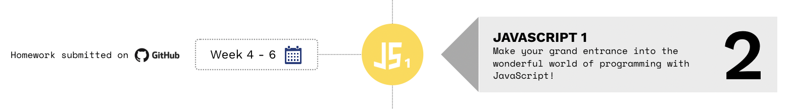
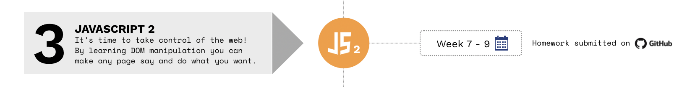
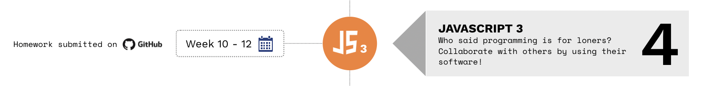

> If you are following the curriculum we recommend you to start with module 1: [HTML/CSS/GIT](https://github.com/SocialHackersCodeSchool/HTML-CSS). To get a complete overview, click [here](https://github.com/SocialHackersCodeSchool/curriculum).

> Please help us improve and share your feedback! If you find better tutorials
> or links, please share them by [opening a pull request](https://github.com/SocialHackersCodeSchool/JavaScript/pulls).

# JavaScript!
Here we learn JavaScript, starting from scratch and moving on to more advanced concepts.  

## Module #2 - [JavaScript1](https://github.com/SocialHackersCodeSchool/JavaScript1/)

In this module you'll make a start into the wonderful world of programming. We will be using the programming language JavaScript to do so. You'll learn about the basic building blocks of programming: `loops`, `functions`, `control flow` and more. Consider these as the ABC's of programming, without them it's impossible to write working software!

| Week | Topic                                                                             | Reading Materials                                                                       | Homework                                                                                 | Lesson Plan                                                                                     |
| ---- | --------------------------------------------------------------------------------- | --------------------------------------------------------------------------------------- | ---------------------------------------------------------------------------------------- | ----------------------------------------------------------------------------------------------- |
| 1.   | What is JavaScript?, Variables, Data Structures & Naming Conventions              | [Reading W1](https://github.com/SocialHackersCodeSchool/JavaScript1/tree/master/Week1/README.md) | [Homework W1](https://github.com/SocialHackersCodeSchool/JavaScript1/tree/master/Week1/MAKEME.md) | [Lesson Plan W1](https://github.com/SocialHackersCodeSchool/JavaScript1/tree/master/Week1/LESSONPLAN.md) |
| 2.   | Statements vs. Expressions, Control flow, Loops, Operators, Conditional statement | [Reading W2](https://github.com/SocialHackersCodeSchool/JavaScript1/tree/master/Week2/README.md) | [Homework W2](https://github.com/SocialHackersCodeSchool/JavaScript1/tree/master/Week2/MAKEME.md) | [Lesson Plan W2](https://github.com/SocialHackersCodeSchool/JavaScript1/tree/master/Week2/LESSONPLAN.md) |
| 3.   | Functions, Thinking like a programmer I, How JavaScript relates to HTML/CSS       | [Reading W3](https://github.com/SocialHackersCodeSchool/JavaScript1/tree/master/Week3/README.md) | [Homework W3](https://github.com/SocialHackersCodeSchool/JavaScript1/tree/master/Week3/MAKEME.md) | [Lesson Plan W3](https://github.com/SocialHackersCodeSchool/JavaScript1/tree/master/Week3/LESSONPLAN.md) |

### **Module goals**

By the end of this module, students should have a familiarity with and basic understanding of the following:

- Have an idea of what `computer programming` is
- Know the basic building blocks of `JavaScript`
- Correctly write and use `variables`, `functions` and `loops`
- Understand the `control flow`
- Think like a programmer

## Module #3 - [JavaScript2](https://github.com/SocialHackersCodeSchool/JavaScript2)

In **JavaScript2** you'll learn all about how to use JavaScript within the browser. First, you'll learn about how HTML is structured within your browser: we call this the `Document Object Model` (DOM). Once you've gotten the hang of that we'll apply JavaScript to it, in order to manipulate the elements and make our pages more interactive. We call this `DOM manipulation` and it's one of the most interesting things about JavaScript!

| Week | Topic                                                                | Reading Materials                                                                       | Homework                                                                                 | Lesson Plan                                                                                     |
| ---- | -------------------------------------------------------------------- | --------------------------------------------------------------------------------------- | ---------------------------------------------------------------------------------------- | ----------------------------------------------------------------------------------------------- |
| 1.   | Document-Object Model (DOM), DOM manipulation                        | [Reading W1](https://github.com/SocialHackersCodeSchool/JavaScript2/tree/master/Week1/README.md) | [Homework W1](https://github.com/SocialHackersCodeSchool/JavaScript2/tree/master/Week1/MAKEME.md) | [Lesson Plan W1](https://github.com/SocialHackersCodeSchool/JavaScript2/tree/master/Week1/LESSONPLAN.md) |
| 2.   | Synchronous vs. asynchronous, Event Loop, Callbacks, Array Functions | [Reading W2](https://github.com/SocialHackersCodeSchool/JavaScript2/tree/master/Week2/README.md) | [Homework W2](https://github.com/SocialHackersCodeSchool/JavaScript2/tree/master/Week2/MAKEME.md) | [Lesson Plan W2](https://github.com/SocialHackersCodeSchool/JavaScript2/tree/master/Week1/LESSONPLAN.md) |
| 3.   | Scope, Hoisting, Closures, Thinking like a programmer II             | [Reading W3](https://github.com/SocialHackersCodeSchool/JavaScript2/tree/master/Week3/README.md) | [Homework W3](https://github.com/SocialHackersCodeSchool/JavaScript2/tree/master/Week3/MAKEME.md) | [Lesson Plan W3](https://github.com/SocialHackersCodeSchool/JavaScript1/tree/master/Week1/LESSONPLAN.md) |
| 4.   | Test                                                                 | [Details](https://github.com/SocialHackersCodeSchool/JavaScript2/tree/master/test/README.md)     | -                                                                                        | -                                                                                               |

### **Module goals for JavaScript2**

In order to successfully complete this module you will need to master the following:

- Understand what the `Document Object Model` (DOM) is
- Use the basics of `DOM Manipulation`
- Differentiate between `synchronous` and `asynchronous` operations
- Gain awareness of the inner workings of JavaScript
- Learn to think based on principles, instead of libraries and frameworks

## Module #4 - [JavaScript3](https://github.com/SocialHackersCodeSchool/JavaScript3)

A big part of being a programmer means moving data from one place to another. It also means working with other people's software. In this module you'll be learning about one of the core things of what makes a web developer: working with APIs!

On top of that you'll also learn how to think differently about how you write your programs. Like in any field, once you've mastered a particular way of doing things you start thinking about how it could be done differently. In programming we call these `paradigms` and in this module you'll learn one such paradigm: Object-Oriented Programming!

| Week | Topic                                                                                       | Reading Materials                                                                       | Homework                                                                                 | Lesson Plan                                                                                     |
| ---- | ------------------------------------------------------------------------------------------- | --------------------------------------------------------------------------------------- | ---------------------------------------------------------------------------------------- | ----------------------------------------------------------------------------------------------- |
| 1.   | Application Programming Interface (API), AJAX, Modules & Libraries                          | [Reading W1](https://github.com/SocialHackersCodeSchool/JavaScript3/tree/master/Week1/README.md) | [Homework W1](https://github.com/SocialHackersCodeSchool/JavaScript3/tree/master/Week1/MAKEME.md) | [Lesson Plan W1](https://github.com/SocialHackersCodeSchool/JavaScript3/tree/master/Week1/LESSONPLAN.md) |
| 2.   | Promises, Fetch API, JavaScript Versions, 'this' keyword, Arrow functions                   | [Reading W2](https://github.com/SocialHackersCodeSchool/JavaScript3/tree/master/Week2/README.md) | [Homework W2](https://github.com/SocialHackersCodeSchool/JavaScript3/tree/master/Week2/MAKEME.md) | [Lesson Plan W1](https://github.com/SocialHackersCodeSchool/JavaScript3/tree/master/Week2/LESSONPLAN.md) |
| 3.   | Object-Oriented Programming (OOP), ES6 Classes, Async/await, Thinking like a programmer III | [Reading W3](https://github.com/SocialHackersCodeSchool/JavaScript3/tree/master/Week3/README.md) | [Homework W3](https://github.com/SocialHackersCodeSchool/JavaScript3/tree/master/Week3/MAKEME.md) | [Lesson Plan W1](https://github.com/SocialHackersCodeSchool/JavaScript3/tree/master/Week3/LESSONPLAN.md) |
| 4.   | Final JavaScript Test                                                                       | [Details](https://github.com/SocialHackersCodeSchool/JavaScript3/tree/master/test.md)            | -                                                                                        | -                                                                                               |

### **Module goals for JavaScript3**

In order to successfully complete this module you will need to master the following:

- Learn what an `Application Programming Interface` (API) is
- Catch up on the `history of JavaScript`
- Understand how to write more readable `asynchronous` JavaScript
- Connect with different `public APIs`
- Build a `Single Page Application` (SPA)
- Work with pre-existing code
- Learn about `Object-Oriented Programming`
